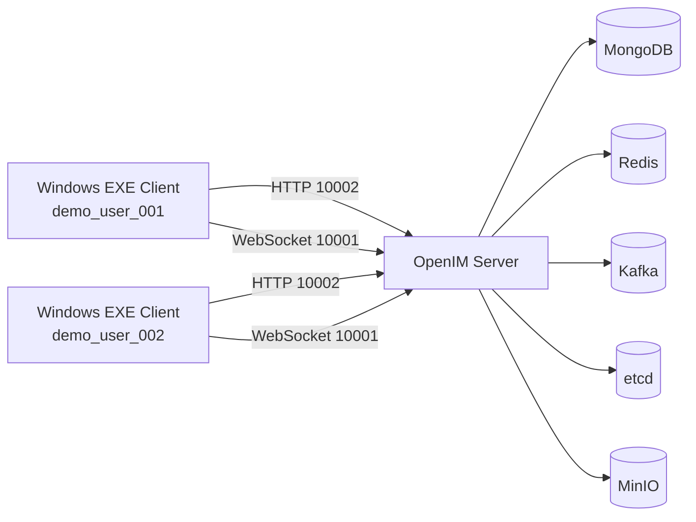
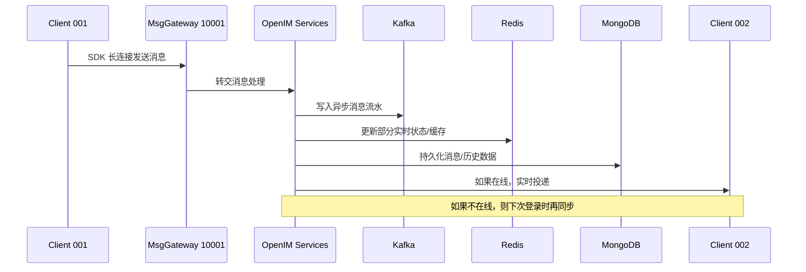

# OpenIM Server 与 Windows EXE 客户端关系说明

本文说明当前这套本地环境里：

- `open-im-server` Docker 部署的服务端
- `openim-electron-demo` 打包出来的 Windows `exe` 客户端

二者之间的职责关系、通信关系，以及用户聊天时的实际网络架构。

本文基于你当前这台电脑上的真实部署，不是泛泛而谈的官方默认拓扑。

## 1. 先说结论

可以把它理解成下面这句话：

> EXE 客户端负责“界面、用户操作、消息展示、与 SDK 交互”，Server 负责“账号、鉴权、消息路由、消息存储、实时投递、群组和好友数据”。

也就是说：

- 客户端不是一个独立聊天系统
- 客户端只是 OpenIM 的一个“终端”
- 真正的账号、消息、会话、好友、群组、离线消息，都在 Server 这一侧

如果没有 Server，客户端无法完成登录、同步、收发消息。

## 2. 你当前这套环境里，分别装了什么

### 2.1 服务端

你当前启动的是 [docker-compose.openim-server.yml](/d:/大连数产/数据流通基础设施/2026年项目/IM/open-im-server/deployments/docker/docker-compose.openim-server.yml)，其中核心组件有：

- `openim-server`
- `mongo`
- `redis`
- `etcd`
- `kafka`
- `minio`

其中 `openim-server` 这个容器不是单一进程，而是通过 [start-config.yml](/d:/大连数产/数据流通基础设施/2026年项目/IM/open-im-server/start-config.yml) 和 `mage start` 启动一组 OpenIM 服务，包括：

- `openim-api`
- `openim-msggateway`
- `openim-msgtransfer`
- `openim-rpc-auth`
- `openim-rpc-user`
- `openim-rpc-friend`
- `openim-rpc-group`
- `openim-rpc-conversation`
- `openim-rpc-msg`
- `openim-rpc-third`
- `openim-push`
- `openim-crontask`

对客户端真正暴露出来的主要入口是：

- HTTP API：`http://127.0.0.1:10002`
- WebSocket 网关：`ws://127.0.0.1:10001`

### 2.2 Windows 客户端

你刚才安装/打包的是 Electron 桌面客户端，也就是：

- 安装包：`OpenCorp-Base_1.0.0.exe`
- 免安装版：`OpenCorp-Base.exe`

它本质上是：

- Electron 外壳
- React 前端界面
- OpenIM Electron / WASM SDK

客户端本地负责：

- 登录页、聊天页、联系人页、群组页
- 本地缓存与本地数据库
- 维护和 OpenIM Server 的连接
- 把用户点击“发送消息”的动作交给 SDK
- 把 SDK 收到的消息展示到界面

## 3. 这次你本地环境的一个关键点

这次部署不是 OpenIM Electron Demo 的“官方默认后端模式”，而是我为你做过一次“本地直连适配”。

### 3.1 官方默认模式

原始 `openim-electron-demo` 默认会同时依赖两类后端：

1. OpenIM Server
2. 业务后端 `openim-chat`

默认配置里通常是：

- `10001`：消息网关
- `10002`：OpenIM API
- `10008`：业务后端 `openim-chat`

其中：

- IM 登录态、消息同步、消息收发靠 OpenIM Server
- 手机号注册、验证码、业务用户资料等通常走 `openim-chat`

### 3.2 你当前实际模式

你当前客户端配置在 [.env](/d:/大连数产/数据流通基础设施/2026年项目/IM/openim-electron-demo/.env)：

```env
VITE_WS_URL=ws://127.0.0.1:10001
VITE_API_URL=http://127.0.0.1:10002
VITE_CHAT_URL=http://127.0.0.1:10002
VITE_SERVER_ONLY=true
```

也就是说，现在是：

- 客户端直接对接 OpenIM Server
- 没有额外部署 `openim-chat`
- 登录改成了 `User ID` 模式
- 注册改成直接调用 OpenIM Server 创建用户

这也是为什么你现在可以用：

- `demo_user_001`
- `demo_user_002`

直接登录，而不是走手机号验证码流程。

## 4. Server 和 EXE 客户端的职责划分

### 4.1 Server 负责什么

服务端负责“系统真相”：

- 用户账号与用户资料
- Token 鉴权
- 好友关系、黑名单、群组关系
- 会话列表与未读数
- 消息接收、路由、投递
- 离线消息落库
- 多端同步
- 文件对象存储接入

你可以把 Server 理解成“聊天系统的大脑和数据中心”。

### 4.2 EXE 客户端负责什么

客户端负责“用户体验层”：

- 给用户提供桌面界面
- 调用 API 获取 token 和业务资料
- 初始化 OpenIM SDK
- 建立到 WebSocket 网关的长连接
- 接收实时消息并展示
- 本地保存一部分缓存数据

你可以把 EXE 理解成“操作台 + 显示器 + 输入设备”。

## 5. 登录时，客户端和服务端如何配合

你当前这版客户端登录链路不是手机号登录，而是下面这条链路：

1. 用户在登录页输入 `userID`
2. 客户端通过 HTTP 调用 `/auth/get_admin_token`
3. 客户端再调用 `/user/account_check` 检查用户是否存在
4. 客户端调用 `/auth/get_user_token` 为目标用户换取 IM token
5. 客户端把 `userID + token` 交给 OpenIM SDK
6. SDK 使用：
   - `apiAddr = http://127.0.0.1:10002`
   - `wsAddr = ws://127.0.0.1:10001`
7. SDK 完成初始化、鉴权、长连接建立、消息同步

这一段逻辑在客户端里主要对应：

- [login.ts](/d:/大连数产/数据流通基础设施/2026年项目/IM/openim-electron-demo/src/api/login.ts)
- [useGlobalEvents.tsx](/d:/大连数产/数据流通基础设施/2026年项目/IM/openim-electron-demo/src/layout/useGlobalEvents.tsx)
- [MainContentWrap.tsx](/d:/大连数产/数据流通基础设施/2026年项目/IM/openim-electron-demo/src/layout/MainContentWrap.tsx)

## 6. 用户聊天时，Server 和客户端的关系

假设：

- 用户 A：`demo_user_001`
- 用户 B：`demo_user_002`

当 A 给 B 发消息时，逻辑上发生的是：

1. A 在 EXE 客户端输入消息并点击发送
2. 客户端把消息交给 OpenIM SDK
3. SDK 通过与 `ws://127.0.0.1:10001` 的长连接，把消息送到 Server
4. Server 判断这是单聊、群聊还是通知消息
5. Server 调用内部消息服务进行路由和落库
6. 消息会写入存储与缓存体系
7. 如果 B 在线，Server 会把消息实时推到 B 的长连接
8. 如果 B 不在线，Server 会把消息作为离线消息保留
9. B 下次上线时，SDK 会从 Server 同步回来

所以“发消息”不是客户端之间直接点对点。

真正关系是：

- 客户端 A -> Server
- Server -> 客户端 B

不是：

- 客户端 A -> 客户端 B

## 7. 你当前环境的网络架构

### 7.1 总体图



### 7.2 本机端口关系

你本机当前主要端口如下：

- `10001`：消息网关 WebSocket
- `10002`：OpenIM HTTP API
- `10004`：MinIO Console
- `10005`：MinIO S3
- `16379`：Redis
- `37017`：MongoDB
- `12379`：etcd

## 8. OpenIM Server 内部组件在消息链路中的作用

虽然你外部看到的是一个 `openim-server` 容器，但内部其实是多组件协作。

### 8.1 `openim-api`

职责：

- 对外提供 HTTP API
- 处理登录、用户、好友、群组、消息管理接口

例如：

- `/auth/get_admin_token`
- `/auth/get_user_token`
- `/user/get_users_info`
- `/msg/send_msg`

### 8.2 `openim-msggateway`

职责：

- 负责客户端实时长连接
- 接收客户端在线消息
- 将消息实时推送给在线接收方

你客户端里的 `ws://127.0.0.1:10001` 连接的就是它。

### 8.3 `openim-msgtransfer`

职责：

- 负责消息转发、异步处理、历史消息相关链路

### 8.4 各类 `rpc-*` 服务

职责：

- `rpc-auth`：鉴权、token
- `rpc-user`：用户数据
- `rpc-friend`：好友关系
- `rpc-group`：群组关系
- `rpc-conversation`：会话和未读数
- `rpc-msg`：消息处理
- `rpc-third`：对象存储等第三方能力

可以理解为：

- `openim-api` 和 `openim-msggateway` 是入口
- 各个 `rpc-*` 是后方业务处理服务

## 9. MongoDB、Redis、Kafka、etcd、MinIO 分别干什么

### 9.1 MongoDB

主要负责持久化数据，例如：

- 用户资料
- 会话与消息相关数据
- 离线消息或历史消息数据

它更像“长期保存的数据仓库”。

### 9.2 Redis

主要负责高频访问和快速状态数据，例如：

- 在线状态
- 某些缓存数据
- 一些会话/消息的快速访问状态

它更像“高速缓存层”。

### 9.3 Kafka

主要负责消息异步流水线。

消息进入系统后，不一定所有动作都同步完成。Kafka 用来承接：

- 消息异步处理
- 消息分发流水
- 某些写库、转发、解耦逻辑

它更像“消息总线”。

### 9.4 etcd

主要负责服务发现和配置协调。

因为 OpenIM 是微服务架构，不同服务之间需要知道彼此在哪里、如何连接，etcd 就承担这部分基础协调能力。

它更像“服务注册表 + 配置协调中心”。

### 9.5 MinIO

主要负责文件对象存储，例如：

- 图片
- 语音
- 视频
- 文件附件

文本消息一般不走 MinIO，但媒体消息会和 MinIO 有关系。

## 10. 发送一条文本消息时的实际链路

下面以 `demo_user_001` 给 `demo_user_002` 发送一条文本消息为例。



## 11. 为什么客户端能看到历史消息

因为消息并不是只存在客户端本地。

消息通常至少有两层：

- 本地缓存：客户端为了提升体验，保存最近消息和索引
- 服务端存储：真正的历史消息由 Server 维护

所以当你：

- 退出客户端再登录
- 在另一台设备登录
- 接收离线期间的消息

都依赖服务端的同步能力，而不是依赖当前这台电脑本地缓存。

## 12. 你当前这套“本地直连模式”的限制

因为我们这次没有部署 `openim-chat` 等业务侧服务，所以当前 EXE 客户端有这些特征：

- 支持 `userID` 方式登录
- 支持直接创建本地测试用户
- 支持基础聊天、联系人、群组等 OpenIM 核心能力
- 不支持原始 demo 里的手机号验证码注册流程
- 不支持密码找回流程
- 不支持 RTC 音视频能力

所以这套更适合：

- 本地联调
- OpenIM 核心 IM 能力验证
- 开发阶段演示

如果后面你要做正式产品，通常还会再加：

- 业务后端
- 统一登录体系
- 用户中心
- 文件域名与 HTTPS
- 音视频服务
- 消息推送服务

## 13. 一句话理解整套架构

一句话总结：

> EXE 客户端是“用户操作入口”，OpenIM Server 是“消息和账号中心”，Mongo/Redis/Kafka/etcd/MinIO 是 Server 背后的基础设施，真正聊天时永远是“客户端连服务端”，而不是“客户端直接互连”。

## 14. 对你现在测试的实际意义

对你当前这套环境，最重要的理解有三点：

1. `demo_user_001` 和 `demo_user_002` 的账号、token、消息都在 Server 侧，不在 EXE 本身。
2. EXE 只是展示和操作终端，换一台客户端也能登录同一个账号继续同步。
3. 现在这套本地环境已经具备“单机 IM 核心验证”能力，但还不是完整商业化生产架构。

